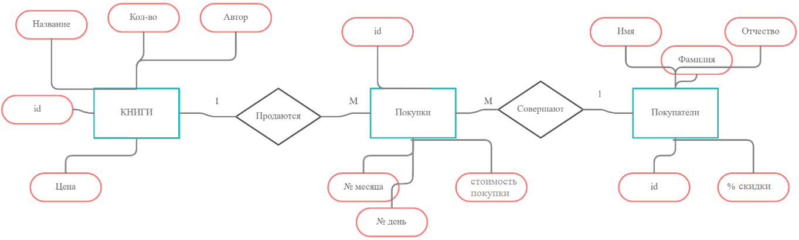

# Book-store-database
Выполнили работу: Панкратова Анжелла, Удачина Анастасия 18ПМИ-2

## Предметная область и организация базы данных
В качестве предметной области в нашей лабораторной работе берётся упрощённая модель книжного магазина (КНИГИ-ПОКУПАТЕЛИ-ПОКУПКИ).

## Схема БД

База данных включает в себя 3 сущности: Книги, Покупки, Покупатели.

Каждая таблица содержит свои атрибуты:  

 #### Книги
- book_id SERIAL PRIMARY KEY (уникальный первичный ключ)
- title VARCHAR NOT NULL UNIQUE
- author VARCHAR NOT NULL
- price integer NOT NULL CONSTRAINT valid_price CHECK (price > 0)
- amount integer NOT NULL CONSTRAINT valid_amount CHECK (amount >= 0)

#### Покупатели
- person_id SERIAL PRIMARY KEY (уникальный первичный ключ)
- first_name VARCHAR NOT NULL
- last_name VARCHAR NOT NULL
- patronymic VARCHAR NOT NULL
- discount integer DEFAULT 0 CONSTRAINT valid_discount CHECK (discount >= 0 AND discount <= 100)

#### Покупки
- id SERIAL PRIMARY KEY (уникальный первичный ключ)
- book_id integer NOT NULL,
- person_id integer NOT NULL,
- dd integer NOT NULL CONSTRAINT valid_dd CHECK (dd >= 1 and dd <= 31)
- mm integer NOT NULL CONSTRAINT valid_mm CHECK (mm >= 1 and mm <= 12)
- purchase_price integer NOT NULL CONSTRAINT valid_price CHECK (purchase_price > 0)

## Индексы
- В таблице Книги индексом является атрибут **author**. В БД можно посмотреть на записи с определенным автором, либо удалить их.
- В таблице Покупатели индексом является атрибут **last_name**. Например, в БД можно посмотреть, есть ли среди покупателей люди с одинаковой фамилией.
- В таблице Покупки индексом является атрибут **book_id**. В БД можно посмотреть записи о покупках с определенной книгой, и удалить их при желании.

## Триггеры
- Атрибут таблицы Покупки **purchase_price** заполняется только триггером calculate_purchase_price_with_discount, который считает итоговую стоимость покупки, учитывая процент скидки покупателя.
- Атрибут таблицы Книги **amount** уменьшается на 1 после того, как пользователь добавит в таблицу Покупки запись о покупке книги.

## Проверка на 3 нормальные формы:
1 НФ: 
- Атомарность значений.
БД находится в 1-ой нормальной форме, так как все сущности во всех своих полях не имеют значений, представленных кортежами.  

2 НФ:  
- Наша БД находится в 1-ой нормальной форме.
- Все атрибуты каждой таблицы зависят от всего ключа и не зависит от его частей.  
То есть: в Книгах не ключевые поля такие как: автор, количество, цена, зависят от book_id.  
В Покупках день, месяц, стоимость покупки зависят только от id.  
В Покупателях фамилия, имя, отчество, скидка зависят также от person_id.  

3 НФ:  
- Наша БД находится во 2-ой нормальной форме.
- Нет транзитивных зависимостей атрибутов от первичного ключа, все зависимости идут напрямую.  
Ни для одной таблицы не нужно создавать дополнительные таблицы, так как атрибуты напрямую связаны с ключом.
